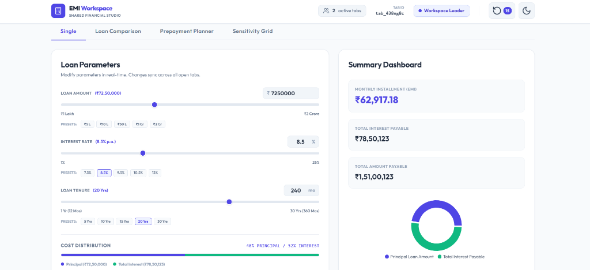

# EMI Workspace - Shared Financial Studio



**EMI Workspace** is a production-grade, serverless collaborative studio designed to manage, compare, and simulate loans in real-time. By leveraging client-side browser APIs, the workspace synchronizes inputs, comparison matrices, prepayment schedules, modes, and themes across multiple open browser tabs instantly. 

Built using **Next.js 14 (App Router)** and **Tailwind CSS**, the interface implements a traditional, high-contrast fintech theme (Indigo & Obsidian) inspired by leading investment platforms.

---

## 🚀 Core Features

### 1. Interactive Loan Parameters & Presets
* **Quick Preset Pills:** Clickable shortcut buttons for common loan amounts (`₹5L` to `₹2Cr`), interest rates (`7.5%` to `12%`), and tenures (`5Y` to `30Y`) for instant scenario hydration.
* **Cost Distribution Bar:** A horizontal progress bar at the bottom of the card showing the exact percentage ratio of Principal vs Total Interest (e.g., `48% Principal / 52% Interest`).
* **Indian Rupee (INR) Formatting:** All figures format according to the Indian numbering system (e.g., `₹72,50,000` instead of millions).

### 2. Summary Dashboard & Visualizations
* **Ratio Pie Chart:** A Recharts pie chart displaying the ratio of Principal to Interest, complete with custom hover tooltips and clear legends.
* **Summary Cards:** Dynamic, real-time recalculation of the Monthly Installment (EMI), Total Interest Payable, and Total Amount Payable.

### 3. Dynamic Amortization Schedule
* **Pagination:** Grouped by years (12 monthly payments per page) with page indicators and navigation controls.
* **Interactive Area Chart:** A stacked area chart showing progress of Principal vs Interest paid over the life of the loan.
* **Break-Even Analysis:** Automatically detects and highlights the exact month where the Principal component of the EMI starts exceeding the Interest component.
* **CSV Exporter:** Generates and downloads clean, structured spreadsheets of the full schedule.

### 4. Loan Comparison Matrix
* **Side-by-Side Analysis:** Input parameters for up to 3 separate loan scenarios simultaneously.
* **Cheapest Scenario Highlight:** The best deal is highlighted in an emerald-green theme (emerald border, card tint, badges, and focus rings) representing financial savings.

### 5. What-If Sensitivity Grid
* **Simulation Matrix:** Simulates changes in Interest Rates ($\pm1\%$, $\pm2\%$, $\pm3\%$) and Tenures ($\pm6$, $\pm12$, $\pm24$ months).
* **Variance Percentage:** Shows the exact EMI shift and positive/negative variance percentage relative to your current active parameters.

### 6. Prepayment Planner
* **Lump Sum Scheduling:** Add single or multiple prepayments at target months.
* **Tenure & Interest Savings:** Instantly calculates the exact amount of interest saved and months cut off from your tenure.
* **Re-Amortization:** Recomputes the entire schedule dynamically, displaying prepayment highlights inside the amortization table.

### 7. Real-Time Tab Synchronization
* **BroadcastChannel API:** Synchronizes the context store in-memory across all tabs on the same origin without using a backend database or WebSocket server.
* **Instant Teardown (`beforeunload`):** When a tab is closed or reloaded, it broadcasts a `TAB_CLOSED` signal to instantly clean up its entry from other tabs' active counts.
* **Visibility Hydration:** Inactive background tabs request the latest state from the leader the exact millisecond they come back into focus (`visibilitychange`), bypassing browser throttling.

### 8. Distributed Leader Election
* **Consensus Algorithm:** Determines the leader tab deterministically by sorting active Tab IDs alphabetically.
* **Failover:** If the leader tab closes, remaining tabs elect a new leader instantly in under 50ms.

### 9. Cross-Tab Undo (Ctrl + Z)
* **History Snapshots:** A global history stack of up to 50 edits is synced across tabs. Pressing `Ctrl + Z` in one tab rolls back changes on all other open tabs simultaneously.

---

## 🛠️ Technology Stack

* **Framework:** Next.js 14+ (App Router, Client Components)
* **UI Library:** React 18
* **Styling:** Tailwind CSS (Class-based dark/light modes)
* **Visualizations:** Recharts (Area & Pie charts)
* **Icons:** Lucide React
* **State Management:** React Context API + `useReducer`
* **Real-Time Channel:** HTML5 `BroadcastChannel` API

---

## 📁 Project Directory Layout

```text
src/
├── app/
│   ├── globals.css         # Custom obsidian theme variables, slider tracks, scrollbars
│   ├── layout.js           # Font optimization, metadata setup, SVG favicon injection
│   └── page.js             # View director, URL params sync, global hotkeys
├── components/
│   ├── Header.js           # Session statistics, active tab counters, undo/redo
│   ├── EMICalculator.js    # Sliders, quick presets, cost distribution, Pie chart
│   ├── AmortizationSchedule.js # Repayments table, stacked Area chart, CSV exporter
│   ├── LoanComparison.js   # Side-by-side cards, cheapest green badge highlighting
│   ├── PrepaymentPlanner.js# Prepayment scenarios, financial impact summary
│   └── SensitivityAnalysis.js # Rate vs Tenure sensitivity matrix grid
├── context/
│   └── WorkspaceContext.js # Central store, reducers, undo stack history
├── hooks/
│   ├── useBroadcastSync.js # Syncs state packets from other tabs
│   ├── usePresence.js      # Publishes heartbeats, prunes stale connections
│   ├── useLeaderElection.js# Requests state from leader on mount or focus
│   ├── useThemeSync.js     # System-wide light/dark theme synchronizer
│   ├── useComparison.js    # Manages comparison scenarios & cheapest index
│   ├── usePrepaymentPlanner.js # Calculates prepayment schedule impacts
│   └── useSensitivityGrid.js # Memoizes sensitivity matrix values
├── engines/
│   └── financialEngine.js  # Pure math financial formulas (floating-point safe)
├── services/
│   └── broadcastService.js # Singleton BroadcastChannel wrapper class
└── utils/
    ├── formatters.js       # Indian Currency formatters, CSV compiler utilities
```

---

## ⚙️ Running Locally

### 1. Install Dependencies
```bash
npm install
```

### 2. Start Development Server
```bash
npm run dev
```

### 3. Test Multi-Tab Sync
Open `http://localhost:3000` in multiple browser windows side-by-side to watch the inputs, presets, calculations, and modes synchronize in real-time.

---

## 🚀 Deploying to Netlify

The project is configured for **Static HTML Export** with custom Netlify build instructions:

1. **Static Build Output:** Enabled via `output: 'export'` and `images: { unoptimized: true }` in `next.config.js`.
2. **Build Config Blueprint:** Defined inside `netlify.toml` in the project root:
   ```toml
   [build]
     command = "npm run build"
     publish = "out"
   ```

To deploy:
1. Push your repository to GitHub.
2. Link your repository to Netlify.
3. Netlify will automatically detect the `netlify.toml` file and deploy the site!
